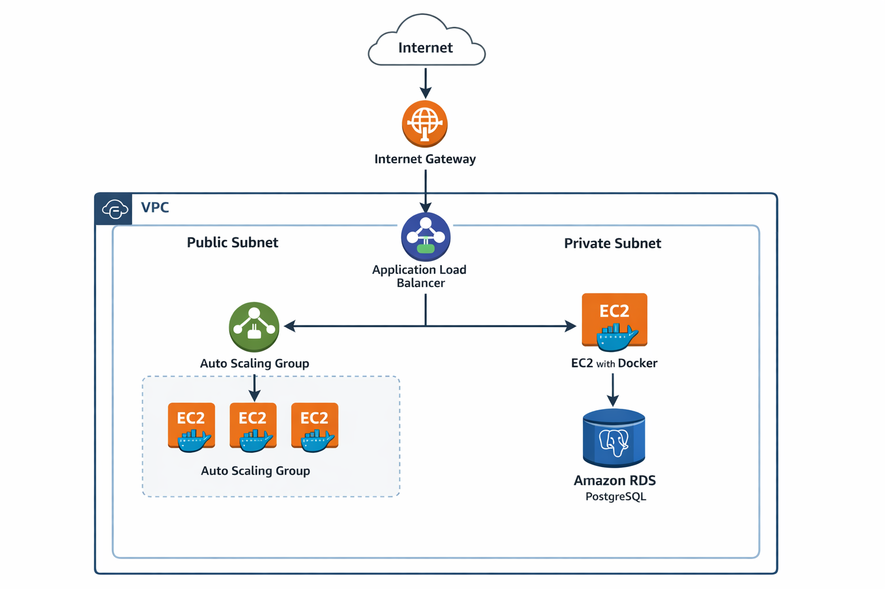

# 👋 Hi, I'm Wesley Santos

Senior Technical Support Engineer → DevOps & Cloud Engineer

Brazilian IT professional with 8+ years of experience in technical support, infrastructure, and mission-critical environments. Recently completed the **IBM Applied DevOps Engineering Professional Certificate**, strengthening my expertise in CI/CD, containers, cloud-native deployment, security, and observability.

I combine strong troubleshooting skills with modern DevOps practices to build reliable, automated, and scalable systems.

---

## 🚀 Professional Focus

- DevOps & Cloud Engineering
- Infrastructure Reliability
- CI/CD & Automation
- Monitoring & Observability
- Secure Application Deployment

Currently open to opportunities as:
**DevOps Junior | DevOps Engineer | Cloud Support Engineer | SRE (Junior)**

---

## 🛠️ Technical Skills

### DevOps & Cloud
- CI/CD (GitHub Actions, Tekton, Jenkins)
- Docker & Docker Compose
- Kubernetes & OpenShift
- Microservices & Serverless Architecture
- Monitoring & Observability (OpenTelemetry, Prometheus concepts)
- Linux environments

### Security & DevSecOps
- Application Security Fundamentals
- Secure Coding Practices
- Container Security Concepts
- Vulnerability Analysis Basics

### Programming & Scripting
- Python (automation-focused)
- Bash scripting

### Infrastructure & Support
- Advanced troubleshooting
- Networking fundamentals (IP, DHCP, routing basics)
- Windows & Linux systems
- Virtualization concepts
- Incident prioritization in critical environments

---

## 🎓 Certifications

**IBM Applied DevOps Engineering – Professional Certificate (2026)**  
Completed 9-course program including hands-on labs and capstone project covering:

- Containers & Kubernetes
- CI/CD pipelines
- Microservices & Serverless
- Application Security
- Monitoring & Observability
- DevOps Capstone Project

---

## 🔧 Featured Projects

### DevOps Capstone Project
End-to-end DevOps project implementing CI/CD pipelines, containerized services, and automated deployment workflows.

Tech stack:
Python • Docker • CI/CD • Kubernetes

Repository:
https://github.com/DragonKzWy/devops-capstone-project

---

### CI/CD Pipeline Implementation
Implementation of automated build and testing pipelines using GitHub Actions.

Tech stack:
Python • GitHub Actions • Docker

Repository:
https://github.com/DragonKzWy/ci-cd-final-project

---

## ☁️ Cloud Journey

Currently expanding my expertise in AWS cloud architecture and infrastructure automation.

Focus areas:

• AWS infrastructure  
• Infrastructure as Code (Terraform)  
• Container orchestration  
• Observability and reliability engineering
---

## 🏗 Example Cloud Architecture

  

---

## 🎯 Career Objective

To contribute to high-performance engineering teams by applying DevOps principles, automation, and reliability practices — while continuously evolving technically and professionally.

---

## 📫 Contact

LinkedIn: https://www.linkedin.com/in/wellsantsilva/  
Email: wesley.silva.need@gmail.com  

---

## 📊 GitHub Stats

---

If you'd like to connect, feel free to reach out.
